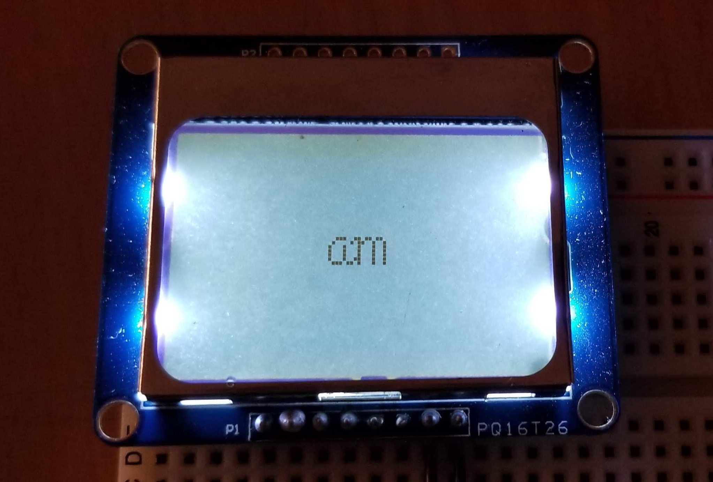

# Arcade
An arcade game created with the TM4C LaunchPad and the Nokia Monochrome 5110 LCD Display. Ongoing personal project. 

# How It Works
So far, the program displays my initials onto the LCD as seen in the picture below. The data is transmitted with the SSI Protocol. The integrated system timer is used. 
The LCD runs at 3.3V and is connected to the following pins:
 * PA2: Clock
 * PA3: SSI0Fss: CS on LCD
 * ~ PA4: MISO (Receive): Not used
 * PA5: MOSI (Transmit): DIN on LCD
 * PA6: GPIO: D/C (Data/Command) on LCD
 * PA7: GPIO: RST (Reset) on LCD

# Built With
* Embedded C
* [Nokia 5110/3310 monochrome LCD](https://www.adafruit.com/product/338)
* [ARM Cortex-M4F Based MCU TM4C123G LaunchPad Evaluation Kit](http://www.ti.com/tool/EK-TM4C123GXL)
* [TI Code Composer Studio IDE](http://www.ti.com/tool/CCSTUDIO)
* [PCD8544 Datasheet](https://cdn-shop.adafruit.com/datasheets/pcd8544.pdf)
* tm4c123gh6pm.h - TM4C123GH6PM Register Definitions
* A breadboard, wires, and a soldering iron

